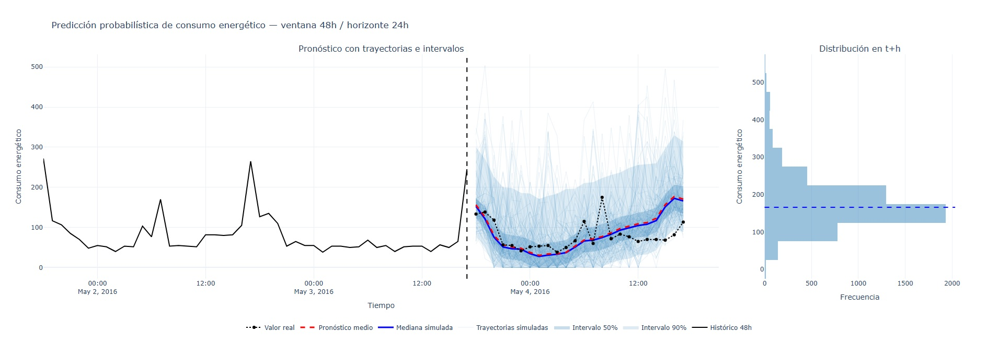

# Predicción probabilística de consumo energético

Proyecto de forecasting aplicado al consumo energético, desarrollado en Python a partir de datos públicos de UCI Machine Learning Repository.

El objetivo fue construir una visualización interactiva que represente una predicción probabilística del consumo energético usando una ventana histórica de 48 horas y un horizonte futuro de 24 horas.

<p align="center">
  
</p>

## Objetivo

Predecir el consumo energético futuro y cuantificar la incertidumbre mediante trayectorias simuladas, intervalos de predicción y distribución esperada al final del horizonte.

## Metodología

- Descarga y preparación de datos energéticos.
- Transformación de la serie temporal a frecuencia horaria.
- Creación de variables rezagadas para representar una ventana histórica de 48 horas.
- Incorporación de variables externas como temperatura, humedad, viento y visibilidad.
- Entrenamiento de un modelo Ridge como baseline multivariable.
- Evaluación mediante MAE y RMSE.
- Simulación de trayectorias futuras mediante remuestreo de residuos.
- Cálculo de cuantiles P05, P25, P50, P75 y P95.
- Visualización interactiva con Plotly y exportación a HTML.

## Herramientas utilizadas

- Python
- Pandas
- NumPy
- Scikit-learn
- Plotly
- Google Colab

## Resultado

El proyecto genera un gráfico interactivo con:

- histórico observado de 48 horas;
- horizonte futuro de 24 horas;
- trayectorias simuladas;
- intervalo de predicción 50%;
- intervalo de predicción 90%;
- pronóstico medio;
- valor real observado;
- distribución final en t+h.

## Métricas del modelo base

- MAE: 35.40
- RMSE: 55.37

## Estructura del repositorio

```text
notebook/
  prediccion_consumo_energia.ipynb

outputs/
  grafico_prediccion_consumo_energia_5000.html

assets/
  preview_prediccion_consumo_energia.png
